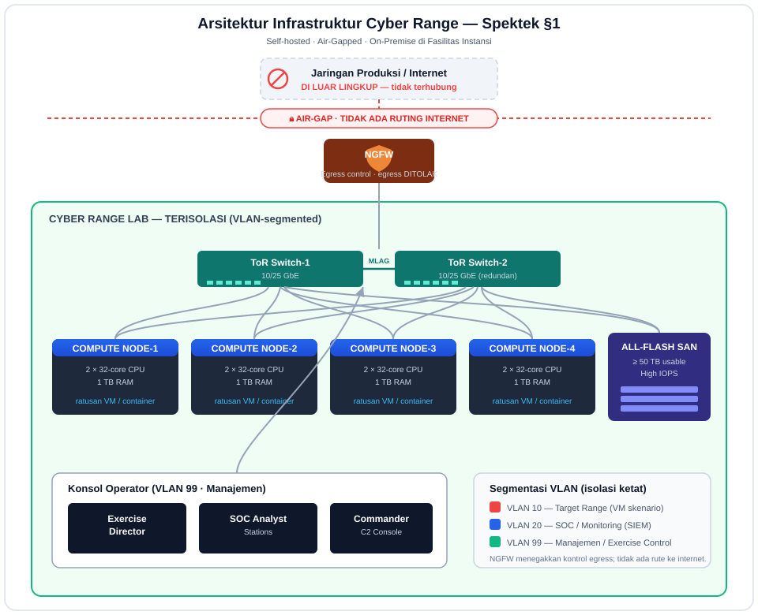

# Infrastruktur Cyber Range — Spektek §1 (Hardware & Jaringan)

Dokumen ini menjelaskan arsitektur **infrastruktur fisik** cyber range sesuai
Bagian 1 Spektek. Bagian ini **tidak diimplementasikan dalam kode** (ini pengadaan
perangkat keras), jadi didokumentasikan sebagai desain acuan. Isolasi jaringannya
*dimodelkan* di software lewat guardrail (lihat catatan di bawah).

## Diagram topologi

> File sumber: [`infrastructure-topology.svg`](infrastructure-topology.svg) — SVG
> vektor, bisa dibuka langsung di browser atau di-embed ke laporan.

## Komponen (Bill of Materials acuan)

| Kategori | Spesifikasi minimum | Peran |
|---|---|---|
| **Compute** | ≥ 4 node server enterprise, masing-masing 2 × 32-core CPU, 1 TB RAM | Menjalankan ratusan VM/container sebagai target skenario |
| **Storage** | SAN all-flash, ≥ 50 TB usable, high IOPS | Image VM, snapshot, log/telemetri exercise |
| **Switching** | 2 × ToR switch 10/25 GbE (redundan, MLAG) | Backbone lab, dual-homing compute & storage |
| **Security** | 1 × NGFW | Kontrol egress; menegakkan larangan ruting internet |
| **Isolasi** | Air-gap + segmentasi VLAN ketat | Pemisahan total dari jaringan produksi/internet |

## Segmentasi VLAN

| VLAN | Segmen | Isi |
|---|---|---|
| **VLAN 10** | Target Range | VM/container skenario (rentan, "korban") |
| **VLAN 20** | SOC / Monitoring | SIEM, sensor, koleksi log |
| **VLAN 99** | Manajemen / Exercise Control | Konsol Exercise Director, SOC, Commander |

## Prinsip keamanan (mengikat ke §4)

- **Air-gap**: lab terputus fisik/logis dari internet dan jaringan produksi. NGFW
  berada di batas dan **menolak semua ruting egress** — tidak ada jalur keluar.
- **Redundansi**: dua ToR switch dengan MLAG; compute & SAN dual-homed agar tidak
  ada single point of failure saat exercise berjalan.
- **Kill switch**: mekanisme darurat (fisik/logis) untuk mematikan seluruh VM
  latihan seketika (diimplementasikan di software pada platform, §4).

## Hubungan ke implementasi software

Meskipun hardware di luar lingkup kode, platform software **memodelkan** batas-batas
ini agar aman:

- Guardrail isolasi menolak alamat IP publik/routable — hanya rentang privat
  RFC1918 yang boleh muncul di topologi lab (setara "tidak ada ruting internet").
- Kill switch di aplikasi menghentikan seluruh node skenario (setara sakelar
  darurat fisik).
- Segmentasi peran (VLAN 99) tercermin sebagai RBAC 5 peran di aplikasi.

