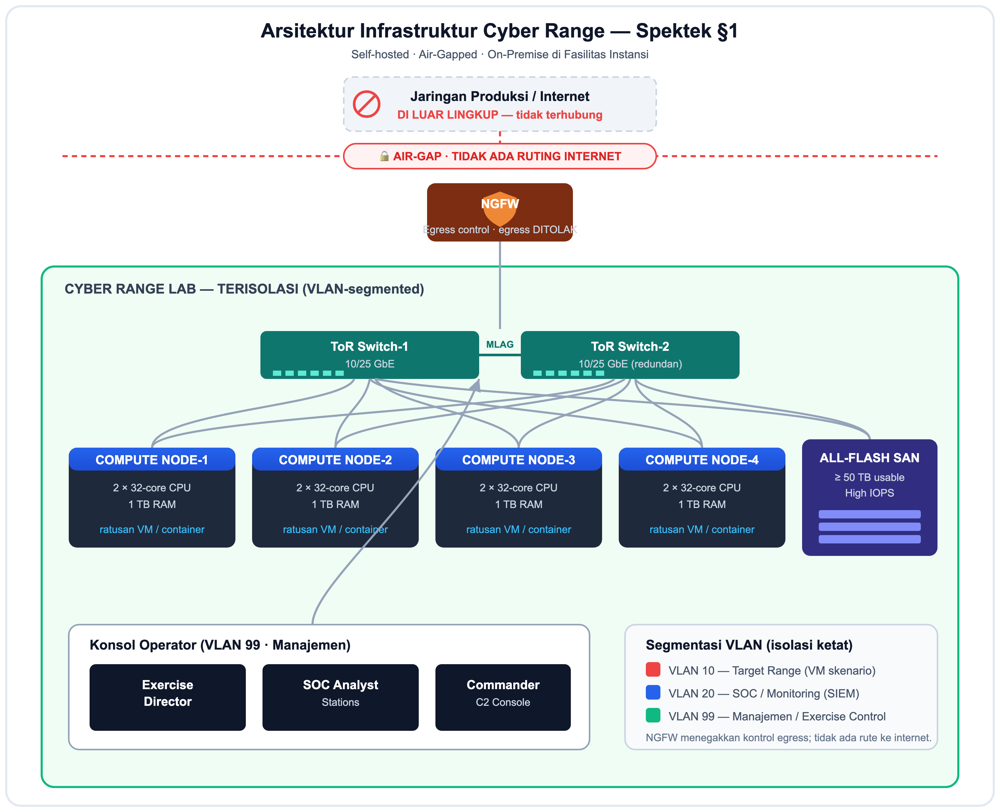

# Spesifikasi Teknis (Spektek)
## Defensive Cyber Simulator — Cyber Range Pelatihan Tim Biru

| | |
|---|---|
| **Nama Paket** | Pengadaan Platform Defensive Cyber Simulator (Cyber Range) |
| **Sifat** | Self-hosted · Air-Gapped · On-Premise di fasilitas instansi |
| **Pengguna** | Tim pertahanan siber (Blue Team) instansi/pangkalan |
| **Versi Dokumen** | 1.0 |

---

## 1. Latar Belakang & Tujuan

Instansi memerlukan sarana pelatihan pertahanan siber yang **realistis namun aman**,
terletak di fasilitas sendiri dan **terisolasi penuh** dari jaringan produksi maupun
internet. Platform ini menyediakan lingkungan "cyber range" untuk melatih deteksi,
triase, penanggulangan, dan pemulihan insiden — dengan penekanan utama pada
**kedaulatan data (data sovereignty)** dan **pengaman keselamatan (safety guardrails)**.

**Tujuan:**
1. Menyelenggarakan latihan (exercise) multi-skenario yang terukur.
2. Mengukur kinerja tim melalui metrik waktu respons insiden.
3. Menjamin tidak ada risiko kebocoran data / malware nyata keluar dari lab.

---

## 2. Ruang Lingkup

Spektek terdiri dari empat bagian:

1. **Infrastruktur Hardware & Jaringan** (perangkat keras cyber range).
2. **Perangkat Lunak Platform Inti** (Exercise Director, Scenario Engine, Scoring/AAR).
3. **Modul Pelatihan & Skenario**.
4. **Guardrail Keamanan Wajib** (kritikal).

---

## 3. Definisi & Istilah

| Istilah | Penjelasan |
|---|---|
| **Cyber Range** | Lingkungan laboratorium terisolasi untuk simulasi serangan & latihan pertahanan siber |
| **Blue Team** | Tim bertahan (defensive) yang mendeteksi & menanggulangi serangan |
| **Air-Gap** | Pemisahan fisik/logis total dari jaringan lain (tidak ada koneksi internet) |
| **SOC** | Security Operations Center — pusat pemantauan keamanan |
| **SIEM** | Security Information and Event Management — agregasi & korelasi log |
| **EDR** | Endpoint Detection and Response — sensor keamanan di endpoint |
| **NGFW** | Next-Generation Firewall — firewall dengan kontrol aplikasi & egress |
| **OT / ICS** | Operational Technology / Industrial Control System (mis. SCADA/HMI/PLC) |
| **SCADA / HMI** | Sistem kendali & antarmuka operator untuk fasilitas (power, HVAC) |
| **C2** | Command and Control — jalur komando & kendali |
| **ToR Switch** | Top-of-Rack switch — switch akses per rak |
| **MLAG** | Multi-chassis Link Aggregation — agregasi link redundan antar-switch |
| **VLAN** | Virtual LAN — segmentasi jaringan logis |
| **RBAC** | Role-Based Access Control — kontrol akses berbasis peran |
| **AAR** | After-Action Review — laporan evaluasi pasca-latihan |
| **TTD/TTT/TTC/TTR** | Time to Detect / Triage / Contain / Recover — metrik waktu respons insiden |

---

## 4. Bagian 1 — Infrastruktur Hardware & Jaringan

*Gambar 1. Topologi infrastruktur cyber range: 4 compute node, All-Flash SAN,
2 ToR switch (redundan/MLAG), NGFW, isolasi air-gap, dan segmentasi VLAN.*

| ID | Requirement | Spesifikasi minimum |
|---|---|---|
| INF-01 | Compute | ≥ 4 node server enterprise, 2 × 32-core CPU, 1 TB RAM per node |
| INF-02 | Kapasitas VM | Mampu menjalankan ratusan VM/container target skenario |
| INF-03 | Storage | SAN all-flash, ≥ 50 TB usable, high IOPS |
| INF-04 | Switching | 2 × ToR switch 10/25 GbE, redundan (MLAG) |
| INF-05 | Firewall | 1 × NGFW untuk kontrol egress |
| INF-06 | Isolasi | Air-gap + segmentasi VLAN ketat dari jaringan produksi |

**Segmentasi VLAN:**

| VLAN | Segmen | Isi |
|---|---|---|
| VLAN 10 | Target Range | VM/container skenario (target latihan) |
| VLAN 20 | SOC / Monitoring | SIEM, sensor, koleksi log |
| VLAN 99 | Manajemen / Exercise Control | Konsol Exercise Director, SOC, Commander |

---

## 5. Bagian 2 — Perangkat Lunak Platform Inti

| ID | Requirement | Deskripsi |
|---|---|---|
| PLT-01 | Exercise Director Dashboard | Multi-tenant / multi-skenario, tampilan terpusat |
| PLT-02 | Injeksi event | Manual maupun terjadwal (scheduled) |
| PLT-03 | Visualisasi topologi | Real-time, status node (sehat/compromised/quarantined) |
| PLT-04 | Scenario Engine & Workflow Runner | Deploy/destroy lab gaya Infrastructure-as-Code, < 15 menit |
| PLT-05 | Dummy traffic | Traffic pengguna palsu agar lab tampak "hidup" |
| PLT-06 | Scoring Engine | Menangkap metrik insiden TTD/TTT/TTC/TTR secara otomatis |
| PLT-07 | AAR (After-Action Review) | Laporan akhir PDF/Word + timeline + analisis gap SOP |

**Definisi metrik:**

| Metrik | Arti | Target default |
|---|---|---|
| TTD | Time to Detect | 5 menit |
| TTT | Time to Triage | 10 menit |
| TTC | Time to Contain | 30 menit |
| TTR | Time to Recover | 60 menit |

---

## 6. Bagian 3 — Modul Pelatihan & Skenario

| ID | Modul | Deskripsi |
|---|---|---|
| MOD-01 | SOC Simulator | Emulator SIEM: log palsu Firewall/EDR/DNS/Proxy |
| MOD-02 | Web Security Lab | Container aplikasi web rentan (OWASP Top 10) |
| MOD-03 | OT/ICS Digital Twin | SCADA/HMI dummy (power/HVAC), simulasi kegagalan operasional akibat serangan |
| MOD-04 | C2 Resilience & Supply Chain | Dashboard pimpinan: data delay/konflik saat jamming; anomali vendor pihak ketiga (sertifikat kedaluwarsa, hash mismatch) |
| MOD-05 | Ransomware Response | VM disuntik skrip self-encrypt **dummy** (bukan malware nyata) untuk melatih quarantine, isolasi, dan restore backup |

---

## 7. Bagian 4 — Guardrail Keamanan Wajib (Kritikal)

| ID | Requirement | Deskripsi |
|---|---|---|
| KMN-01 | Isolasi ketat | Tolak semua ruting internet |
| KMN-02 | Kill switch | Satu sakelar darurat (fisik/logis) mematikan seluruh VM latihan seketika |
| KMN-03 | Dummy data enforcement | Larang malware nyata, identitas personel nyata, kredensial nyata, dan peta jaringan militer nyata; hanya parameter berbasis allowlist |
| KMN-04 | RBAC | Pemisahan peran ketat: Admin, Exercise Director, Commander, SOC Analyst, Observer |
| KMN-05 | Audit immutable | Log audit tamper-proof (tamper-evident) atas setiap aksi |

---

## 8. Persyaratan Non-Fungsional

| ID | Kategori | Requirement |
|---|---|---|
| NFR-01 | Keamanan deploy | On-premise, air-gapped; tanpa dependensi layanan eksternal untuk autentikasi |
| NFR-02 | Ketersediaan | Redundansi switch & dual-homing compute/storage |
| NFR-03 | Kinerja | Deploy skenario < 15 menit |
| NFR-04 | Auditabilitas | Seluruh aksi tercatat & dapat diverifikasi |
| NFR-05 | Kedaulatan data | Seluruh data tetap di fasilitas instansi |

---

## 9. Lingkup Pekerjaan (Scope of Work)

Lingkup yang diharapkan dari mitra teknis/penyedia:

1. **Instalasi & konfigurasi** infrastruktur (compute, storage, jaringan, NGFW) sesuai Bagian 1.
2. **Deployment platform** perangkat lunak (Bagian 2) dan integrasi modul pelatihan (Bagian 3).
3. **Penerapan guardrail keamanan** (Bagian 4) dan verifikasi isolasi/air-gap.
4. **Pengujian**: FAT (Factory Acceptance Test) dan SAT/UAT (Site/User Acceptance Test).
5. **Pelatihan & transfer knowledge** untuk operator (Exercise Director, SOC, Commander).
6. **Dokumentasi serah terima**: as-built, manual operasi, SOP, dan hasil pengujian.
7. **Dukungan** pasca-implementasi (masa garansi & pemeliharaan — disepakati terpisah).

---

## 10. Kriteria Penerimaan (Acceptance)

1. Exercise Director dapat membuat, men-deploy, dan menghancurkan minimal 2 template skenario.
2. Injeksi serangan dummy memunculkan log SIEM & membuka insiden yang ter-skor.
3. Metrik TTD/TTT/TTC/TTR tercatat dan laporan AAR dapat diunduh.
4. Kill switch menghentikan seluruh node; isolasi menolak ruting internet / IP publik.
5. RBAC menegakkan pemisahan peran; log audit lolos verifikasi integritas.
6. Tidak ada malware/identitas/kredensial nyata yang dapat dimasukkan (ditolak guardrail).
